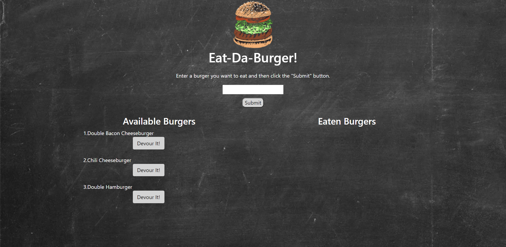

<h1 align="center">Eat-Da-Burger!!</h1>
 
This is a burger logger created using MySQL, Node, Express, Handlebars and a homemade ORM. It follow the MVC design pattern, Node and MySQL is used to query and route data in the app, and Handlebars used to generate the HTML.

## Table of Contents
* [Description](#description)
* [Installation](#installation)
  * [Dependencies](#dependencies)
* [Deployment](#deployment)
* [Usage](#usage)
  * [Screenshots](#screenshots)
  * [Tips](#tips)
* [Contributing](#contributing)
* [Questions](#questions)
* [Credits](#credits)
* [License](#license)

## Description
Eat-Da-Burger! is a restaurant app that lets users input the names of burgers they'd like to eat. Whenever a user submits a burger's name, the app will display the burger on the left side of the page -- waiting to be devoured. Each burger in the waiting area also has a 'Devour it!' button. When the user clicks it, the burger will move to the right side of the page.The app will store every burger in a database, whether devoured or not. The app is deployed with Heroku and [jawsDB](https://www.jawsdb.com/) is also use as a database.

## Installation
Node.js is required ([See download information here](https://nodejs.org/en/download/)). 

### Dependencies
* [express](https://www.npmjs.com/package/express)
* [express-handlebars](https://www.npmjs.com/package/express-handlebars)
* [mysql](https://www.mysql.com/)

## Deployment 
[Heroku](https://www.heroku.com/what) allows developers to deploy and manage their apps.

[Click here to deploy app]()
 
## Usage
The user is able to enter the name of the burger they would like to eat. Once the burger name is submitted, the name of the burger and a 'Devour it' button will appear on the left side of the app. Once the Devour button is clicked, the burger moves to the right side of the app. All burgers are storedin the database.

#### Screenshots




#### Tips
1. You are able to clone this repo or download a zip file to your local machine.

2. If you have cloned a repo and a package.json exists, you are able to see the dependencies and dev dependecies used in the application. If this is the case run the below comand to get all the depencies need for that application.
```
$ npm i
```
3. When using Heroku to deploy your app ensure that your `package.json` file is set up correctly. It must have a `start` script and all the project's dependencies defined. E.g.:
```
  },
     "scripts": {
       "start": "node server.js"
     }
   }
```
## Contributing
Please first discuss the change you wish to make via issue or email, before making a change.

Steps to contribute: 
1. Fork the repo on GitHub.
2. Clone the project to your own machine.
3. Commit changes to your own branch.
4. Push your work back up to your fork/branch
5. Submit a Pull Request so that we can review your changes

## Questions  
If you have any questions, I can be reached via:
* <bold>Email</bold>: nash.walters@outlook.com

## Credits
* [Adam Simonini](https://github.com/adamsimonini)

## License
Copyright © 2021 Nash Walters,

Released under the [MIT](https://github.com/nashwalters/eng-team-generator/blob/main/LICENSE) license.
